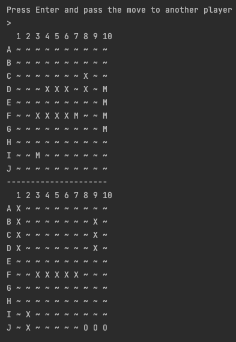

# Jogo de Batalha Naval

Este é um simples jogo de Batalha Naval implementado em Java.

## Como jogar

O jogo é jogado no terminal (linha de comando). Cada jogador terá que posicionar as suas embarcações no campo de batalha e tentar afundar as embarcações do oponente com tiros precisos.

O campo de batalha tem um tamanho fixo de 10x10, representado por letras de 'A' a 'J' nas linhas e números de 1 a 10 nas colunas.

## Requisitos

- Java 8 ou superior

## Como executar o jogo

1. Clone o repositório:

   - `git clone https://github.com/seu-usuario/battleship.git`

2. Compile o código:

   - `cd battleship`
   - `javac Main.java`

3. Execute o jogo:
   - `java Main`

## Instruções do jogo

1. No início do jogo, cada jogador deve posicionar as suas embarcações no campo de batalha.
2. O jogo irá alternar entre os jogadores, permitindo que eles efetuem um disparo a cada rodada.
3. Os jogadores devem inserir as coordenadas do tiro (por exemplo, "B7") e aguardar o resultado.
4. O jogo continua até que todas as embarcações de um jogador sejam destruídas.

## Comandos do jogo

Durante o jogo, você pode usar os seguintes comandos:

- `Enter`: Passa a vez para o próximo jogador.
- `Ctrl + C`: Encerra o jogo.

## Como posicionar as embarcações

Quando solicitado, insira as coordenadas para posicionar cada embarcação. As coordenadas devem estar no formato "A1 B1" (início e fim da embarcação).

Por exemplo:

*Enter the coordinates of the Aircraft Carrier (5 cells):*

A1 A5

